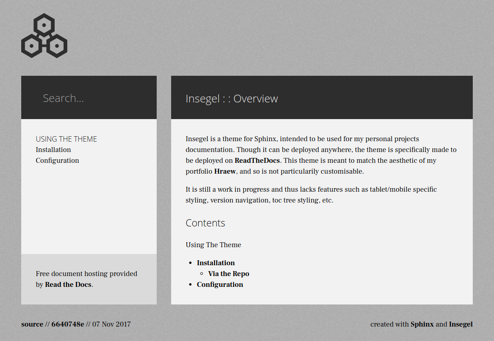

=======
Insegel
=======

.. image:: https://readthedocs.org/projects/insegel/badge/?version=latest
    :target: http://insegel.readthedocs.io/en/latest/?badge=latest
    :alt: Documentation Status

Insegel is a theme for `Sphinx`_, intended to unify my project documentation's
theme with that of `Hrǽw`_. The theme's documentation is available on
`ReadTheDocs`_.

.. _Sphinx: http://www.sphinx-doc.org/en/stable/
.. _Hrǽw: https://github.com/Autophagy/hraew
.. _ReadTheDocs: http://insegel.readthedocs.io
